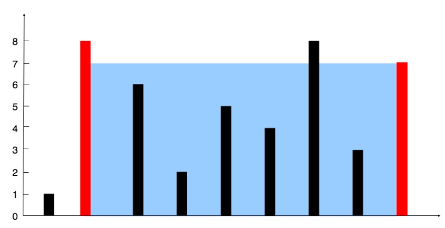

## 盛最多水的容器

给定一个长度为 `n` 的整数数组 `height` 。有 `n` 条垂线，第 `i` 条线的两个端点是 `(i, 0)` 和 `(i, height[i])` 。

找出其中的两条线，使得它们与 `x` 轴共同构成的容器可以容纳最多的水。

返回容器可以储存的最大水量。

**说明：**你不能倾斜容器。

比如有数组[1,8,6,2,5,4,8,3,7]，按描述对应的图例为



### 解题

根据木桶效应，能装多少水高度取决于最矮的木板，即取决于两条垂线构成的容器的短边，再乘以容器的宽度就能得到容量

移动时，容器的宽度必定减小，那么就只有移动短边和移动长边两种情况：

因为容量取决于短边，若向内移动短边长边不变，水槽的短边可能变大，因此下个水槽的面积可能增大；

而若向内移动长边短边不变，如果移动后的边大于等于短边，那么容量不变，而如果移动后的边小于短边，那么容量此时取决于自己，容量变小。

所以综上，要想容量变大每次移动应该移动短边。那么就有以下代码

```java
public int maxArea(int[] height) {
    ·		//获得数组长度
		 	int n = height.length;
		 	//设置左右指针i和j
	        int i = 0;
	        int j = n-1;
	        int area = 0;
	        //左右指针分别从最左边和最右边开始移动，到中间i >= j后停止
	        while(i < j){
	            int tempArea;
            //能装多少水高度取决于最矮的木板
	            tempArea = Math.min(height[i],height[j])*(j-i);
            //每次比较i，j处的height,移动短的一方
	        //移动高的一边底边减小短边不变，容量必定减小
	        //而移动短的一边是有可能会增大的，所以持续移动短边寻找最大值
	            if(height[i] > height[j]){
	                j--;
	            }else if(height[i] <= height[j]){
	                i++;
	            }
            //保存最大值
	            area = Math.max(area,tempArea);
	        }
	        return area;
	    }
```

### 思考

极简写法

```java
public int maxArea0(int[] height) {
	        int i = 0, j = height.length - 1, res = 0;
	        while(i < j) {																//首先无论每次i和j哪边移动，动的都是最短边，所以移动i时容量就是j-i乘以height[i]，移动j时容量就是j-i乘以height[j]
	            res = height[i] < height[j] ? 
//因为运算中i++是先计算再自增，利用height[i++]即可实现计算当前指针的容量后再移动的行动
	                Math.max(res, (j - i) * height[i++]): 
	                Math.max(res, (j - i) * height[j--]); 
	        }
	        return res;
	    }
```

